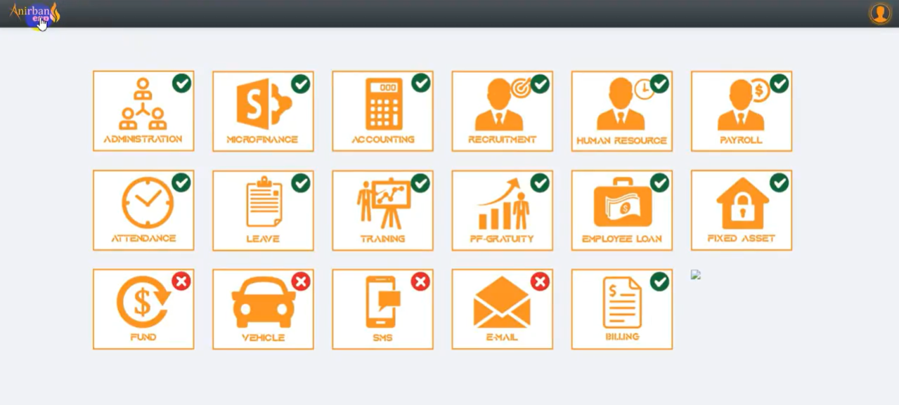
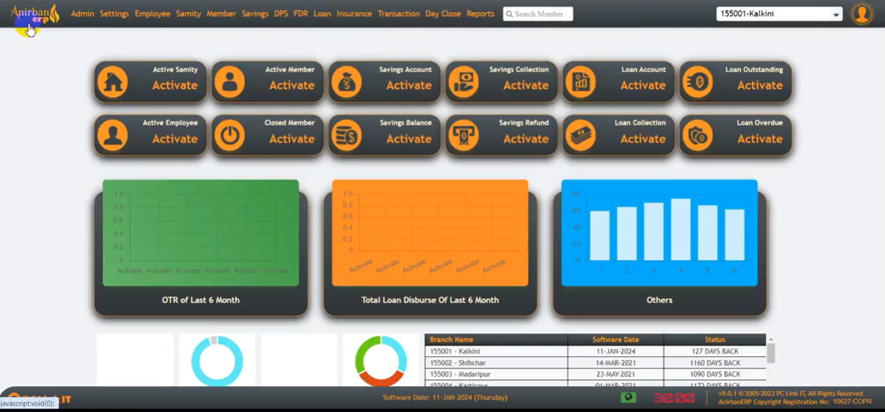
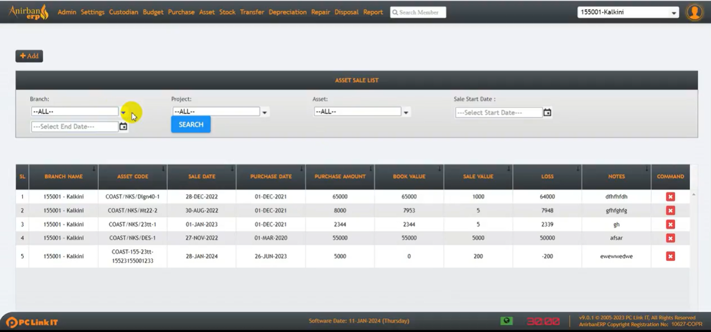
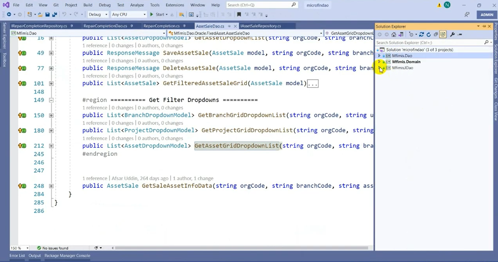

# Microfinance-ERP-System

  

Large-scale ASP.NET MVC based Microfinance ERP solution with Oracle DB, Kendo UI, HRM, Payroll, Savings, and Loan management.

---

## Features

- Loan Management
- Savings Management
- DPS & FDR
- Employee Loan
- Payroll
- HRM
- Fixed Asset
- Reporting
- Branch Wise Operations

---

## Technology Stack

### Backend
- ASP.NET MVC 4
- C#
- .NET Framework 4.8
- Entity Framework 5
- Web API

### Frontend
- jQuery 1.7.1
- Kendo UI MVC
- Bootstrap 2.3.2
- Knockout.js

### Database
- Oracle Database
- Oracle.DataAccess

---

## Architecture

- Presentation Layer
- Service Layer
- DAO/Repository Layer
- DTO Layer
- Domain Layer

---

## Modules

- Administration
- Microfinance
- Accounting
- HRM
- Payroll
- Fixed Asset
- Reports
- Security & Role Management

---

## Screenshots

## Dashboard

## Modules

## Asset Management

## Solution Architecture

## Solution Architecture Data

---

## Environment

- Visual Studio 2019 / 2022
- IIS Express
- .NET Framework 4.8
- Oracle Client

---

## Disclaimer

This repository is created for demo and portfolio purposes only.
